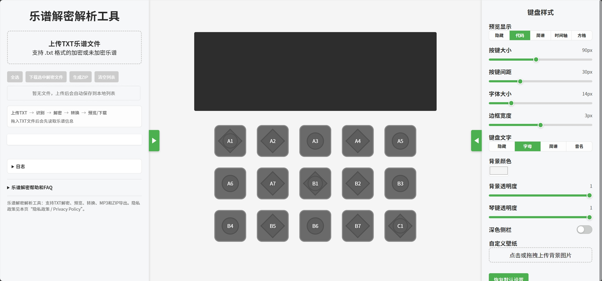

# Sky Studio乐谱解密解析工具 / Sky Studio Music Decrypt Tool

在线网站 / Online website: [https://bilibiliales.github.io/skystudio-decrypt/](https://bilibiliales.github.io/skystudio-decrypt/)

## 中文说明

Sky Studio乐谱解密解析工具是一个纯静态单页面网页，用于处理 Sky Studio TXT 乐谱文件。它支持光遇乐谱解密、TXT 加密文件识别、在线预览、简谱转换、键盘可视化、MP3 音频导出、批量下载和 ZIP 导出。

## 功能

- 支持加密 TXT 乐谱文件的本地解密。
- 支持光遇乐谱预览、键盘高亮和音频播放。
- 支持代码、简谱、时间轴、方格谱等多种预览方式。
- 支持直接导出 MP3 音频，不需要通过预览录音生成。
- 导出的 MP3 会写入标题、作者和改编者备注等基础音频属性。
- 支持下载解密结果、脚本和简谱图片。
- 支持多文件选择、批量下载和 ZIP 导出。
- 纯静态 GitHub Pages 工具，无需后端服务。

## 使用方法

1. 打开在线工具：[https://bilibiliales.github.io/skystudio-decrypt/](https://bilibiliales.github.io/skystudio-decrypt/)
2. 上传或拖拽一个或多个 Sky Studio `.txt` 乐谱文件。
3. 在文件列表中选择乐谱，查看元数据并进行预览。
4. 下载解密结果、复制生成代码、导出简谱图片、导出 MP3，或批量生成 ZIP。

## 隐私说明

本项目是纯静态网页，不提供账号登录、数据库、表单提交或服务端文件上传功能。你选择的 TXT 乐谱文件会由浏览器本地读取和处理，不会被本项目上传到服务器。

页面会从 GitHub Pages 加载预览所需的音频、图片、CSS 和脚本等静态资源。导出 MP3 时，页面会按需加载浏览器端 MP3 编码器，用于把本地离线渲染的音频转换成文件。浏览器可能在本地保存界面设置、背景图片设置或工作列表，用于恢复使用体验；你可以通过浏览器设置清除站点数据。

## English

Sky Studio Music Decrypt Tool is a pure static single-page website for Sky Studio TXT sheet files. It supports encrypted sheet detection, browser-side decryption, online preview, notation conversion, keyboard visualization, MP3 audio export, batch download, and ZIP export.

## Features

- Decrypt supported encrypted TXT music sheet files in the browser.
- Preview music with keyboard visualization and audio playback.
- View converted content as code, simplified notation, timeline, or grid notation.
- Export MP3 audio directly from the note timeline without recording preview playback.
- Write basic MP3 metadata such as title, artist, and arranger notes.
- Download decrypted results, scripts, and notation images.
- Select multiple files for batch download and ZIP export.
- Run as a static GitHub Pages site without a backend.

## Usage

1. Open the online tool: [https://bilibiliales.github.io/skystudio-decrypt/](https://bilibiliales.github.io/skystudio-decrypt/)
2. Upload or drag one or more Sky Studio `.txt` sheet files into the upload area.
3. Select a file from the local list to inspect metadata and preview the music.
4. Download the decrypted result, copy generated code, export notation, export MP3, or create a ZIP archive.

## Privacy

This project is a static website. It does not provide user accounts, a database, form submission, or a server-side file upload workflow. Selected TXT files are read and processed locally by your browser and are not uploaded by this project.

The page loads static assets such as audio files, images, CSS, and scripts from GitHub Pages. MP3 export loads a browser-side MP3 encoder on demand, then converts locally rendered audio into a downloadable file. Your browser may store local UI settings, background image settings, or the local working list so the page can restore your experience later. You can clear this data through your browser site settings.

## Screenshots

## Notes

The source avoids literal ampersand characters where possible so the page remains easier to embed in environments such as WordPress.

## Credits

This repository uses code or ideas from:

- [tokisakiyuu/skypiano](https://github.com/tokisakiyuu/skypiano)
- [NikoYOYO/sky-decrypt-tool](https://github.com/NikoYOYO/sky-decrypt-tool)
